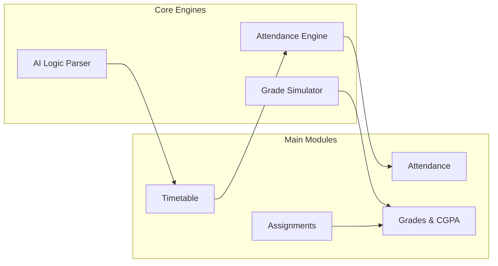
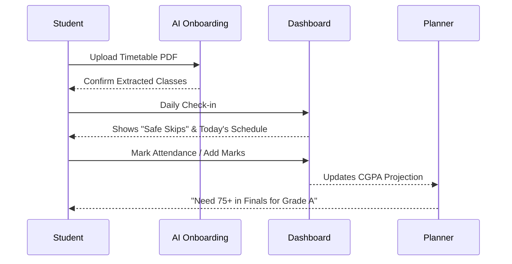

<div align="center">
  
  <h1>Scholify</h1>
  <p><strong>A Smart Academic Companion for University Students</strong></p>
</div>

<br />

Scholify is a retro-futuristic, mobile-responsive web application designed to help university students take control of their academic lives. By combining smart timetable extraction, attendance monitoring, assignment tracking, and grade planning, Scholify brings all essential university metrics into a single, beautiful dashboard.

Live Demo: [https://scholify-b4d9f.web.app](https://scholify-b4d9f.web.app)

## ✨ Key Features

- **🤖 AI Timetable Extraction**: Upload your university timetable as a PDF, and Scholify uses the Gemini AI API via Firebase Cloud Functions to parse and organize your entire weekly schedule automatically.
- **📊 Real-Time Attendance**: Track your daily classes. Scholify calculates your "safe skips" to keep your attendance above 75%.
- **📝 Assignment & Grade Dashboard**: Keep tabs on upcoming deadlines, graded assignments, and track your overall semester standing.
- **🎯 CGPA Planner**: Enter your past semester grades and current courses to calculate and strictly forecast the grades you need to reach your target CGPA.
- **📅 Smart Academic Calendar**: Sync up your university schedule with official national holidays dynamically baked into your attendance predictions.
- **🎨 Dark & Light Mode Support**: Deeply optimized, highly performant retro-futuristic dark mode theme alongside a pristine light mode.
- **☁️ Cloud Sync**: Fully local-first experience with `localStorage` that seamlessly background-syncs to Firebase Firestore if you log in!

## 💻 Tech Stack

- **Frontend**: React 18, TypeScript, Vite
- **Styling**: Tailwind CSS, Framer Motion (for micro-interactions)
- **State Management**: Zustand
- **Backend & Cloud**: Firebase (Authentication, Firestore, Cloud Functions, Hosting)
- **AI Integration**: Google Generative AI (Gemini 2.5 Flash)

## 🚀 Quick Start

To run the project locally on your machine:

1. **Clone the repository**
   ```bash
   git clone https://github.com/ArnavGarg7/Scholify.git
   cd Scholify
   ```

2. **Install dependencies**
   ```bash
   npm install
   ```

3. **Configure Environment**
   You don't need to do anything extra if you're pulling from Firestore; the `.env` settings for Firebase are mapped inside `src/lib/firebase.ts`. Simply log in through the UI!

4. **Start the development server**
   ```bash
   npm run dev
   ```

5. **Build for production**
   ```bash
   npm run build
   ```

## 🌐 Deployment Details

This project is automatically deployed and hosted on **Firebase Hosting**.

- **Hosting**: Deployed as an SPA (Single Page Application) with strict rewritten routing on Firebase.
- **Database**: Firestore is structured to securely store decentralized states mapping to individual `auth.uid` documents.
- **Serverless**: Advanced PDF parsing happens securely in Firebase Cloud Functions to prevent API keys from leaking to the client.

To manually re-deploy the project:
```bash
# Compile and package the frontend
npm run build

# Push straight to Firebase Hosting
firebase deploy --only hosting
```

## 🧩 Feature Architecture

Scholify is organized into four high-performance modules that work together to track your academic health in real-time.



### Key Modules:
- **Smart Attendance**: Automatically calculates "Safe Skips" by mapping your timetable against the official academic calendar (holidays included).
- **AI Sync**: Decodes complex, Fragmented university PDFs into a structured daily schedule.
- **Grade What-If**: An interactive simulator that predicts your final GPA based on your current marks and target goals.
- **Deadline Hub**: A sorted assignment feed that uses neon color-coding (Safe/Warning/Danger) based on submission proximity.

## 🔄 User Workflow

The Scholify journey is designed to be low-friction, moving from automated setup to daily micro-interactions.



### The Daily Cycle:
1. **The Setup**: Fast Google Sign-in followed by AI extraction of your messy university PDF.
2. **The Routine**: Check your dashboard every morning to see if you can afford to skip a class.
3. **The Tracking**: One-tap marking for attendance and a quick-entry form for exam marks.
4. **The Goal**: Use the CGPA planner mid-semester to see exactly what scores you need in your upcoming finals to hit your target GPA.

---
*Developed by Arnav Garg*
